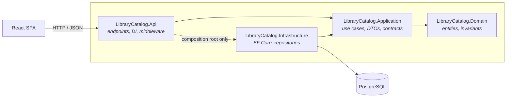
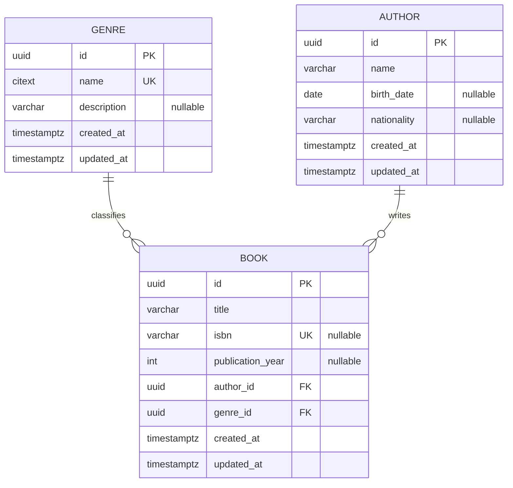

# Library Catalog

A small catalog system to search, register and maintain **genres**, **authors** and **books** — built for the [Senior Software Engineer technical challenge](docs/technical-challenge.pdf) briefed in this repository.

> **Build status:** documentation-first. This README describes the solution as designed; the code is being implemented against it. This note is removed once the repository fully matches the document.

**Stack:** .NET 10 (ASP.NET Core Web API) · React 19 + TypeScript + Vite · PostgreSQL 17 · EF Core 10 · Docker Compose

---

## Table of contents

1. [Overview](#1-overview)
2. [Getting started](#2-getting-started)
3. [Architecture](#3-architecture)
4. [Backend organization](#4-backend-organization)
5. [API reference](#5-api-reference)
6. [Frontend organization](#6-frontend-organization)
7. [Database](#7-database)
8. [Domain rules and validation](#8-domain-rules-and-validation)
9. [Security](#9-security)
10. [Testing strategy](#10-testing-strategy)
11. [Trade-offs](#11-trade-offs)
12. [Known limitations](#12-known-limitations)
13. [What I would do with more time](#13-what-i-would-do-with-more-time)

---

## 1. Overview

The application manages a library catalog with three entities and two relationships:

- a **genre** classifies many books;
- an **author** writes many books;
- a **book** belongs to exactly one author and exactly one genre.

Every entity supports create, search, update and delete. The SPA exposes the relationship explicitly: the book list and book detail always show the author and genre they resolve to, and genre/author pages show the books that depend on them.

### Feature summary

| Area | Delivered |
|---|---|
| CRUD | Genres, authors and books — full create / read / update / delete |
| Search | Free-text search, pagination and sorting on every list endpoint |
| Relationships | Books resolve author and genre; deletes that would orphan books are rejected |
| Errors | RFC 9457 `application/problem+json` on every failure path, consistent across the API |
| Auth | Public reads, JWT-protected writes (see [Security](#9-security)) |
| Observability | Structured logs with correlation id, `/health` endpoint |
| Tests | Unit tests for domain and use cases, integration tests against a real PostgreSQL |
| Run | `docker compose up` — database, API and SPA |

---

## 2. Getting started

The only prerequisite is Docker with Compose v2.

```bash
git clone https://github.com/alvarolopes/library-catalog.git
cd library-catalog
docker compose up --build
```

| Service | URL |
|---|---|
| SPA | http://localhost:5173 |
| API | http://localhost:8080 |
| OpenAPI / Scalar UI | http://localhost:8080/scalar |
| Health | http://localhost:8080/health |
| PostgreSQL | `localhost:5432` — db `librarycatalog`, user `postgres`, password `postgres` |

The API applies EF Core migrations and seeds reference data on startup, so the catalog is browsable immediately. No manual database setup step is required. Migrations are the source of truth for the schema — there is no hand-written DDL to keep in sync.

### Seeded credentials

Writes require a bearer token. A single staff user is seeded for review purposes:

| Email | Password |
|---|---|
| `admin@librarycatalog.dev` | `Admin@123` |

```bash
curl -X POST http://localhost:8080/api/v1/auth/login -H "Content-Type: application/json" -d "{\"email\":\"admin@librarycatalog.dev\",\"password\":\"Admin@123\"}"
```

---

## 3. Architecture

The backend follows a **lean Clean Architecture**: four projects, dependencies pointing inward, and no framework types leaking into the domain.



**The dependency rule:** `Domain` references nothing. `Application` references only `Domain`. `Infrastructure` implements `Application`'s interfaces, so the arrow points inward even though data flows outward at runtime. `Api` references `Infrastructure` in exactly one place — the composition root — to wire the DI container.

### Why this, and what was deliberately left out

The domain here is genuinely CRUD, so the risk was not under-engineering — it was ceremony that looks like architecture without paying for itself. Concretely:

- **No MediatR / CQRS.** Use cases are plain services (`BookService`, `GenreService`). A mediator would add a dispatch indirection and a package dependency to solve a problem — cross-cutting pipeline behaviors — that this API solves with ASP.NET Core middleware and filters. If the domain grew to the point where commands and queries needed different models, that is when CQRS earns its place.
- **No separate read model.** Queries project directly to DTOs with EF Core `Select`, which produces one SQL statement per request and no over-fetching. Splitting reads and writes across two stores is a scaling answer to a problem this system does not have.
- **Layers, but only four.** Adding a fifth "Services" or "Common" project is a common reflex; it fragments the code without clarifying ownership.

The point of the layering that *did* stay is that the business rules in `Domain` and the use cases in `Application` are testable without a database, an HTTP context, or a running container. That is the property being bought — not the folder count.

---

## 4. Backend organization

```
backend/
├─ LibraryCatalog.sln
├─ src/
│  ├─ LibraryCatalog.Domain/
│  │  ├─ Entities/            Genre, Author, Book
│  │  ├─ Exceptions/          DomainException and specializations
│  │  └─ Abstractions/        Entity base type, domain primitives
│  ├─ LibraryCatalog.Application/
│  │  ├─ Genres/              service, DTOs, validators
│  │  ├─ Authors/
│  │  ├─ Books/
│  │  ├─ Auth/
│  │  └─ Abstractions/        repository + unit-of-work contracts, paging types
│  ├─ LibraryCatalog.Infrastructure/
│  │  ├─ Persistence/         DbContext, entity configurations, migrations
│  │  ├─ Repositories/        EF Core implementations
│  │  ├─ Security/            password hashing, JWT issuing
│  │  └─ DependencyInjection.cs
│  └─ LibraryCatalog.Api/
│     ├─ Endpoints/           Minimal API route groups per resource
│     ├─ Middleware/          correlation id, exception handling
│     └─ Program.cs
└─ tests/
   ├─ LibraryCatalog.UnitTests/
   └─ LibraryCatalog.IntegrationTests/
```

### Request flow

`HTTP request` → endpoint (binding + auth policy) → validator → application service (orchestration, uniqueness checks) → domain entity (invariants) → repository → EF Core → PostgreSQL, and the response maps back to a DTO. Errors are never returned as strings from services — they are thrown as typed domain exceptions and translated once, at the edge.

### Error handling

A single `IExceptionHandler` converts exceptions into `application/problem+json` (RFC 9457). Every failure in the API — validation, not-found, conflict, unhandled — uses the same envelope, which is what makes the responses consistent rather than merely correct.

| Situation | Status | `type` |
|---|---|---|
| Request body fails validation | `400` | `validation-failed` (includes per-field `errors`) |
| Missing or invalid token on a write | `401` | `unauthorized` |
| Authenticated but lacking the `staff` role | `403` | `forbidden` |
| Resource id does not exist | `404` | `resource-not-found` |
| Duplicate genre name, duplicate ISBN | `409` | `duplicate-resource` |
| Deleting a genre or author that still has books | `409` | `resource-in-use` |
| Unhandled exception | `500` | `internal-server-error` (detail suppressed outside Development) |

Every problem response carries the `correlationId`, so a user-reported error maps to a log line without guesswork.

### Validation

Two layers, on purpose, because they answer different questions:

- **FluentValidation** at the boundary answers *"is this request well-formed?"* — required fields, string lengths, ISBN shape, page size bounds. It runs before any database access and returns all field errors at once.
- **Domain entities** answer *"is this state legal?"* — enforced in constructors and methods, so an entity cannot be constructed in an invalid state regardless of which caller reached it.

Uniqueness sits between the two: checked by the application service for a clean `409`, and backed by a database unique index so a race cannot slip a duplicate through.

### Logging and observability

Serilog writes structured JSON. Every request gets a correlation id — taken from the `X-Correlation-Id` header when the client supplies one, generated otherwise — which is attached to the log scope and echoed on both the response header and any problem response. `/health` reports API liveness and database connectivity.

---

## 5. API reference

Base path: `/api/v1`. Interactive documentation at `/scalar`.

| Method | Route | Auth | Success |
|---|---|---|---|
| `POST` | `/auth/login` | — | `200` + token |
| `GET` | `/genres` | — | `200` paged |
| `GET` | `/genres/{id}` | — | `200` |
| `POST` | `/genres` | staff | `201` + `Location` |
| `PUT` | `/genres/{id}` | staff | `204` |
| `DELETE` | `/genres/{id}` | staff | `204` |
| `GET` | `/authors` | — | `200` paged |
| `GET` | `/authors/{id}` | — | `200` |
| `POST` | `/authors` | staff | `201` + `Location` |
| `PUT` | `/authors/{id}` | staff | `204` |
| `DELETE` | `/authors/{id}` | staff | `204` |
| `GET` | `/books` | — | `200` paged |
| `GET` | `/books/{id}` | — | `200` |
| `POST` | `/books` | staff | `201` + `Location` |
| `PUT` | `/books/{id}` | staff | `204` |
| `DELETE` | `/books/{id}` | staff | `204` |

### List parameters

All list endpoints accept `?page=1&pageSize=20&search=&sortBy=&sortDir=asc|desc`. `pageSize` is capped at 100 to keep a client from turning a list endpoint into a full table scan. `/books` additionally accepts `authorId` and `genreId` filters, which is what powers "books by this author" in the SPA.

Responses are envelopes, not bare arrays:

```json
{
  "items": [],
  "page": 1,
  "pageSize": 20,
  "totalItems": 137,
  "totalPages": 7
}
```

Book payloads embed the resolved relationship rather than forcing the client into a second round trip:

```json
{
  "id": "0193f8a2-...",
  "title": "The Left Hand of Darkness",
  "isbn": "9780441478125",
  "publicationYear": 1969,
  "author": { "id": "0193f8b1-...", "name": "Ursula K. Le Guin" },
  "genre":  { "id": "0193f8c4-...", "name": "Science Fiction" }
}
```

---

## 6. Frontend organization

```
frontend/
├─ src/
│  ├─ app/            router, providers, layout shell
│  ├─ features/
│  │  ├─ genres/      pages, form, hooks
│  │  ├─ authors/
│  │  ├─ books/
│  │  └─ auth/        login, token storage, session context
│  ├─ shared/
│  │  ├─ api/         typed HTTP client, request/response types
│  │  ├─ components/  table, pagination, form fields, dialogs, toasts
│  │  └─ hooks/
│  └─ main.tsx
└─ tests/
```

**Organized by feature, not by file type.** A `components/`, `hooks/`, `services/` split scatters one screen across three folders; grouping by feature means everything a resource needs sits together and the boundary between features stays visible. Genuinely shared pieces are the exception, and they live in `shared/`.

**Server state via TanStack Query.** For a CRUD client, most "state" is a cache of server data, and hand-rolling that means hand-rolling loading flags, error branches, refetch and invalidation for every screen. Query provides them, so mutations simply invalidate the affected keys and the lists update. There is no Redux store: the only genuinely client-side state is the auth session and transient UI state, which React context and local state cover.

**Forms via React Hook Form + Zod.** The Zod schema mirrors the API validation rules, so obvious mistakes are caught before a request is sent — while the server still validates independently, since client-side validation is a usability feature, not a security boundary. Server-side field errors from a `400` are mapped back onto the matching form fields.

**Screens:** list pages with search, sortable columns and pagination; a create/edit form per resource; a delete confirmation that surfaces the `409` reason when a genre or author is still in use; and a book detail page linking through to its author and genre.

Styling is Tailwind with a small set of local components. The brief does not require visual sophistication, so the effort went into clear states — loading, empty, error, and disabled-while-saving — rather than into a design system.

---

## 7. Database

### Why PostgreSQL

Any of the three permitted engines would model this domain correctly, so the tiebreaker was the cost imposed on whoever runs the project — and the honesty of the choice.

- **Zero licensing and zero setup friction.** The `postgres:17-alpine` image is roughly 150 MB and is accepting connections in a couple of seconds, which is what makes `docker compose up` and containerized integration tests practical. SQL Server's Linux image is an order of magnitude larger and materially slower to start; in a test suite that spins a container up per run, that difference is the difference between running the tests and skipping them.
- **First-class EF Core support.** Npgsql is a mature, well-maintained provider with good coverage of the constructs used here — case-insensitive text via `citext`, `timestamptz`, UUID keys, and correct translation of the filter and sort expressions behind the list endpoints.
- **Portability.** It behaves identically on Windows, macOS, Linux and CI, so "works on my machine" is not part of the review.

**The honest counter-argument:** in a .NET shop already running SQL Server, alignment with the existing platform — licenses, DBA expertise, backup and monitoring tooling — usually outweighs every point above, and I would pick SQL Server there without hesitation. The EF Core abstraction means that swap is contained in `Infrastructure`: a provider package, a connection string, and regenerated migrations. Nothing in `Domain` or `Application` moves.

### Schema



### Schema decisions

| Decision | Reasoning |
|---|---|
| **UUIDv7 primary keys** | Client- and server-generatable without a round trip, safe to expose in URLs, and — unlike UUIDv4 — time-ordered, so index locality stays reasonable. Sequential integers would be smaller but leak row counts and complicate any future merge of data across environments. |
| **`ON DELETE RESTRICT` on both foreign keys** | Deleting an author must not silently delete their books. The database enforces it; the application checks first so the user gets a `409` with an explanation instead of a constraint violation. |
| **`citext` for genre name** | Uniqueness that matches user intent — "Fiction" and "fiction" are the same genre — enforced by the engine rather than by a lowercase-comparison convention every query has to remember. |
| **Nullable ISBN, unique when present** | Not every catalog entry has one, and PostgreSQL's unique index ignores nulls, so a partial index gives "unique if provided" for free. |
| **`created_at` / `updated_at` on every table** | The cheapest possible audit trail, and the thing you always wish you had added. |
| **Migrations as the source of truth** | No parallel hand-written DDL that can drift from the model. The migration history is reviewable in Git. |

Seed data covers a handful of genres, authors and books so the SPA is not empty on first load, and it is idempotent — restarting the API does not duplicate rows.

---

## 8. Domain rules and validation

The brief's rules, plus the additional validations it invites — each chosen because it protects a real invariant, not to inflate the rule count.

| Rule | Enforced where |
|---|---|
| A book belongs to exactly one author and one genre | Non-nullable foreign keys; entity constructor requires both |
| A genre may have many books; an author may have many books | Schema relationship |
| Genre name is unique, case-insensitive, 2–100 characters | Service check → `409`; `citext` unique index as backstop |
| Book title is required, 1–200 characters | Validator + entity invariant |
| ISBN, when provided, is a valid ISBN-10/13 and unique | Validator (checksum) + partial unique index |
| Publication year, when provided, falls between 1450 and next year | Validator — Gutenberg's press is a defensible floor; the ceiling allows announced titles |
| Author birth date, when provided, is in the past | Validator |
| A genre or author with books cannot be deleted | Service check → `409 resource-in-use`; foreign key `RESTRICT` as backstop |
| Referenced author and genre must exist when creating or updating a book | Service check → `404` naming which reference failed |

The deletion rule is the one worth arguing about, so: the alternatives were cascade delete (unacceptable — one click silently destroys an author's entire catalog) and soft delete (defensible, but it turns every query into a filtered query and every unique index into a partial one — real complexity that this scope does not justify). Blocking the delete and telling the user why is the behavior a librarian would actually expect, and the door to reassigning books first stays open.

---

## 9. Security

Reads are public; writes require a bearer token and the `staff` role. This mirrors how a catalog actually works — the public browses it, staff maintain it — and it means a reviewer can `curl` the API without authenticating first while the authorization path is still exercised end to end.

| Concern | Approach |
|---|---|
| Authentication | JWT bearer, HS256, short expiry, issued by `POST /auth/login` |
| Authorization | Role-based policy (`staff`) applied to every mutating endpoint |
| Password storage | ASP.NET Core `PasswordHasher` (PBKDF2, per-user salt) — never plaintext, never a bare hash |
| Transport | HTTPS redirection and HSTS enabled outside Development |
| CORS | Explicit allowlist of the SPA origin — not `AllowAnyOrigin` |
| Injection | Parameterized queries throughout via EF Core; no string-concatenated SQL |
| Error leakage | Stack traces and inner exception details never cross the API boundary outside Development |
| Abuse | `pageSize` capped; request body size limited |

**Not production-ready, and deliberately so:** the signing key sits in configuration rather than a secret manager, there are no refresh tokens or revocation, no rate limiting on login, and the SPA holds the token in memory with no silent renewal. Each is a known gap listed in [Known limitations](#12-known-limitations) — the goal was a correct, complete auth path at challenge scope, not a hardened identity system.

---

## 10. Testing strategy

The target is confidence per minute of runtime, not a coverage number. Tests concentrate where a bug would be both likely and expensive.

| Layer | Tool | What it covers |
|---|---|---|
| **Unit — domain** | xUnit + FluentAssertions | Entity invariants: a book cannot exist without an author or genre, a genre name must be within bounds, an ISBN checksum must hold. No mocks — these are pure functions over state. |
| **Unit — application** | xUnit + NSubstitute | Use-case orchestration against faked repositories: duplicate name yields conflict, missing reference yields not-found, delete with dependents is refused, update touches only what changed. |
| **Integration — API** | `WebApplicationFactory` + Testcontainers (PostgreSQL) | The full stack against a real database in a disposable container: routing, model binding, auth policies, EF Core query translation, migrations, unique constraints, and the shape of every problem response. |
| **Frontend** | Vitest + Testing Library + MSW | The paths where a user loses data: form validation and submission, server-error mapping back to fields, list pagination and search, and the delete-blocked confirmation flow. |

**Why integration tests use a real PostgreSQL and not the in-memory provider.** The in-memory provider does not enforce unique constraints, does not enforce referential integrity, and does not translate LINQ the way Npgsql does — so precisely the behavior these tests exist to verify is the behavior it fakes. Testcontainers costs a few seconds of container startup and buys tests that fail for the same reasons production would.

```bash
cd backend && dotnet test
```

```bash
cd frontend && npm test
```

**What is not covered:** no end-to-end browser tests, no load or performance tests, and no mutation testing. At three days, the marginal bug caught did not justify the setup time — noted here rather than left for the reader to discover.

---

## 11. Trade-offs

The decisions worth defending, and what each one cost.

| Decision | Alternative considered | Why this way | Cost accepted |
|---|---|---|---|
| Lean Clean Architecture, four projects | Vertical slices; or a single API project | Separation of responsibilities and future evolution are explicit evaluation criteria, and the layering keeps business rules testable without infrastructure. Slices are a strong fit for larger feature sets but need more defending; a single project would read as thin. | More files and one mapping hop for what is, today, CRUD. |
| Plain services for use cases | MediatR / CQRS | The pipeline concerns a mediator usually justifies are already handled by middleware and filters here. Adding it would be ceremony. | If the domain grows commands with genuinely different read and write models, this becomes a refactor. |
| Thin repository interfaces per aggregate | Injecting `DbContext` into application services | Keeps `Application` free of EF Core types and makes use-case tests fast and mock-free. | `DbContext` is already a unit of work and a repository, so this is a real layer of indirection — the counter-argument is legitimate, and I would drop the abstraction in a codebase committed to EF Core for good. |
| PostgreSQL | SQL Server | Free, tiny image, fast startup, mature EF Core provider — which is what makes containerized integration tests and a one-command run realistic. | Loses alignment with the typical .NET shop's existing platform and tooling. |
| Delete blocked when dependents exist (`409`) | Cascade delete; soft delete | Cascade destroys data on a single click. Soft delete leaks into every query and index for value this scope does not need. | The user must clear or reassign books before deleting — more clicks, but no surprises. |
| React + Vite | Angular | Faster to a working, tested SPA within three days, which left the time where the evaluation weight is — the backend and its documentation. | Less prescriptive structure; conventions had to be chosen and stated rather than inherited. |
| Server-side pagination from the start | Return full lists, paginate in the client | A list endpoint that returns an entire table is a defect waiting for production data, and retrofitting paging touches the API contract, the client and the tests at once. | Slightly more work per endpoint up front. |
| Public reads, authenticated writes | No auth at all; or lock down everything | Matches the real access pattern of a catalog and lets a reviewer explore the API immediately, while still exercising authorization end to end. | Not a complete identity solution — see [Security](#9-security). |
| Migrations applied on startup | Manual migration step; init SQL scripts | Makes `docker compose up` genuinely one command for a reviewer. | Unacceptable in production, where migrations belong in a deployment step with a rollback plan. Called out below. |

---

## 12. Known limitations

- **Migrations run on API startup.** Convenient for review, wrong for production — concurrent instances would race, and a failed migration takes the API down with it. Production belongs in a separate, gated deployment step.
- **Secrets live in configuration.** The JWT signing key and database password are in `appsettings` and Compose environment variables. Real deployments need a secret manager and key rotation.
- **Auth is minimal.** One seeded user, no registration, no refresh tokens, no revocation, no rate limiting on login, no account lockout.
- **No caching layer, and no `ETag` / `If-None-Match`.** Every read hits the database. Fine at this size; the first thing to revisit under load.
- **Sorting is limited to an allowlist of columns.** Deliberate — it prevents arbitrary expressions reaching the query — but less flexible than a general query language.
- **No soft delete and no audit history.** Once a record is deleted, it is gone, and there is no record of who changed what.
- **Single-language UI, no i18n and no accessibility audit.** Semantic HTML and labelled controls are used, but no assistive-technology testing was done.
- **No CI pipeline.** Tests run locally; nothing enforces them on push.
- **No end-to-end tests**, and the frontend test suite covers key flows rather than every screen.

---

## 13. What I would do with more time

Roughly in the order I would actually pick them up:

1. **CI on every push** — build, test, and a container image build. It is the cheapest way to stop the list above from growing.
2. **Move migrations out of startup** into a deployment job, and secrets into a secret manager.
3. **Harden auth** — refresh tokens, revocation, login rate limiting, and real user management rather than a seeded account.
4. **OpenTelemetry traces and metrics** alongside the existing structured logs, so a slow request can be attributed to a specific query instead of inferred.
5. **Optimistic concurrency** on updates via a row version, returning `412` instead of letting the last writer win silently — the current behavior is fine for one librarian and wrong for five.
6. **Richer domain** — multiple authors per book, sub-genres, copies and loans. Each is a real cataloging need, and the first would turn the book–author relationship into many-to-many, which is exactly the kind of change the current layering is meant to absorb cheaply.
7. **Bulk import** from CSV or ONIX, with validation reporting per row.
8. **End-to-end tests** on the critical paths, and accessibility testing on the SPA.

---

## Repository layout

```
library-catalog/
├─ README.md
├─ docker-compose.yml
├─ docs/adr/          architecture decision records
├─ backend/           .NET solution — src/ and tests/
└─ frontend/          React SPA
```

Decisions with lasting consequences are recorded as short ADRs in `docs/adr/`, so the reasoning survives independently of this README and of me.
