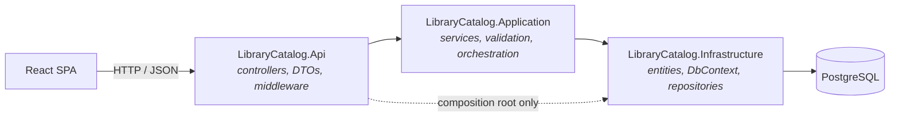
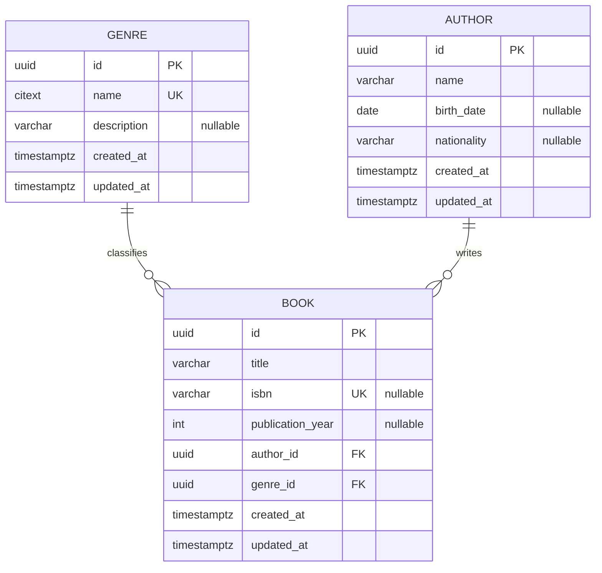

# Library Catalog

A small catalog system to search, register and maintain **genres**, **authors** and **books** — built for the [Senior Software Engineer technical challenge](docs/technical-challenge.pdf) briefed in this repository.

**Stack:** .NET 10 (ASP.NET Core Web API) · React 19 + TypeScript + Vite · Tailwind CSS · PostgreSQL 17 · EF Core 10 · Docker Compose · Playwright

---

## Table of contents

1. [Overview](#1-overview)
2. [Getting started](#2-getting-started)
3. [Architecture](#3-architecture)
4. [Backend organization](#4-backend-organization)
5. [API reference](#5-api-reference)
6. [Frontend organization](#6-frontend-organization)
7. [Database](#7-database)
8. [Domain rules and validation](#8-domain-rules-and-validation)
9. [Security](#9-security)
10. [Testing strategy](#10-testing-strategy)
11. [Trade-offs](#11-trade-offs)
12. [Known limitations](#12-known-limitations)
13. [What I would do with more time](#13-what-i-would-do-with-more-time)

---

## 1. Overview

The application manages a library catalog with three entities and two relationships:

- a **genre** classifies many books;
- an **author** writes many books;
- a **book** belongs to exactly one author and exactly one genre.

Every entity supports create, search, update and delete. The SPA exposes the relationship explicitly: the book list and book detail always show the author and genre they resolve to, and genre/author pages show the books that depend on them.

### Feature summary

| Area | Delivered |
|---|---|
| CRUD | Genres, authors and books — full create / read / update / delete |
| Search | Free-text search and pagination throughout; sorting is offered by the API but not yet wired into the UI |
| Relationships | Books resolve author and genre, and every one is navigable — a book links to both, and each lists the books that depend on it; deletes that would orphan books are rejected |
| Errors | RFC 9457 `application/problem+json` on every failure path, consistent across the API |
| Auth | Public reads, JWT-protected writes (see [Security](#9-security)) |
| Observability | Structured logs with correlation id, `/health` endpoint |
| Tests | Unit, integration (real PostgreSQL), frontend component and one Playwright E2E test — see [Testing strategy](#10-testing-strategy) |
| Run | `docker compose up` — database, API and SPA |

---

## 2. Getting started

The only prerequisite is Docker with Compose v2.

```bash
git clone https://github.com/alvarolopes/library-catalog.git
cd library-catalog
docker compose up --build
```

| Service | URL |
|---|---|
| SPA | http://localhost:5173 |
| API | http://localhost:8080 |
| OpenAPI / Scalar UI | http://localhost:8080/scalar |
| Health | http://localhost:8080/health |
| PostgreSQL | `localhost:5432` — db `librarycatalog`, user `postgres`, password `postgres` |

The API applies EF Core migrations and seeds reference data on startup, so the catalog is browsable immediately. No manual database setup step is required. Migrations are the source of truth for the schema — there is no hand-written DDL to keep in sync.

### Seeded credentials

Writes require a bearer token. A single staff user is seeded for review purposes:

| Email | Password |
|---|---|
| `admin@librarycatalog.dev` | `Admin@123` |

```bash
curl -X POST http://localhost:8080/api/v1/auth/login -H "Content-Type: application/json" -d "{\"email\":\"admin@librarycatalog.dev\",\"password\":\"Admin@123\"}"
```

---

## 3. Architecture

The backend is a **pragmatic three-layer split** — `Api`, `Application`, `Infrastructure` — each with one reason to change: HTTP concerns, business rules, persistence. No Domain project, no repository interfaces, no CQRS.



`Api` calls `Application`, which calls `Infrastructure` directly — a straight top-down dependency, not an inverted one. `Api` also references `Infrastructure` in exactly one place, `Program.cs`, to wire the `DbContext` and repositories into the DI container.

### Why this, and what was deliberately left out

The domain here is genuinely three CRUD entities, so the risk was not under-engineering — it was ceremony that looks like architecture without paying for itself. Concretely:

- **No separate Domain project.** A fourth project whose only job is to hold plain entity classes free of EF Core attributes buys framework-independence for an ORM this solution is already committed to. The entities live in `Infrastructure`, next to the `DbContext` that maps them.
- **No repository interfaces.** `GenreRepository`, `AuthorRepository` and `BookRepository` are concrete classes in `Infrastructure`; `Application` calls them directly. An `IGenreRepository` would exist to support a second implementation that will never ship — PostgreSQL via EF Core is a one-way decision here, not a swappable dependency, so the interface would be indirection with no destination.
- **No MediatR / CQRS.** Use cases are plain services (`GenreService`, `AuthorService`, `BookService`). A mediator would add a dispatch indirection to solve cross-cutting concerns — validation, logging — that ASP.NET Core middleware and filters already solve natively. If the domain grew commands and queries with genuinely different models, that is when CQRS would earn its place.
- **No separate read model.** Queries project straight to DTOs with EF Core, one SQL statement per request, no over-fetching. Splitting reads and writes across two stores answers a scaling problem this system does not have.

The trade-off this buys: `Application` knows it is calling EF Core-backed repositories, so it is not framework-agnostic. In exchange, there is one less project, no interface that exists only to be implemented once, and the layering that remains still does its actual job — `Api`, `Application` and `Infrastructure` can each be reasoned about, and changed, independently. See [Testing strategy](#10-testing-strategy) for how this shapes where tests live.

---

## 4. Backend organization

```
backend/
├─ LibraryCatalog.slnx
├─ Dockerfile
├─ src/
│  ├─ LibraryCatalog.Api/
│  │  ├─ Controllers/         GenresController, AuthorsController, BooksController, AuthController
│  │  ├─ Middleware/          correlation id, global exception handling, validation filter
│  │  └─ Program.cs
│  ├─ LibraryCatalog.Application/
│  │  ├─ Genres/              GenreService, request/response DTOs, validators
│  │  ├─ Authors/
│  │  ├─ Books/
│  │  ├─ Auth/
│  │  └─ Common/              paging types, ISBN checksum, service-level exceptions
│  └─ LibraryCatalog.Infrastructure/
│     ├─ Entities/            Genre, Author, Book, User
│     ├─ Persistence/         DbContext, entity configurations, migrations, seeder
│     ├─ Repositories/        GenreRepository, AuthorRepository, BookRepository, UserRepository
│     ├─ Security/            password hashing, JWT issuing
│     └─ DependencyInjection.cs
└─ tests/
   └─ LibraryCatalog.Tests/
      ├─ Unit/                validators, ISBN checksum, paging arithmetic
      └─ Integration/         WebApplicationFactory + Testcontainers (PostgreSQL)
```

**DTOs live with the service that owns them**, in `Application/<Feature>/`, not in `Api/`. `Application` has to name the types it accepts and returns, and `Api` already depends on `Application` — putting the DTOs in `Api` would invert that and make the dependency circular. The controllers bind straight to these records and return them, so there is one shape per concept rather than an API model and an application model that must be kept in step.

### Request flow

`HTTP request` → controller (binding + auth policy) → validator → application service (orchestration, uniqueness checks) → repository → EF Core → PostgreSQL, and the response maps back to a DTO. Errors are never returned as strings from services — they are thrown as typed exceptions and translated once, at the edge.

### Error handling

A single `IExceptionHandler` converts exceptions into `application/problem+json` (RFC 9457). Every failure in the API — validation, not-found, conflict, unhandled — uses the same envelope, which is what makes the responses consistent rather than merely correct.

| Situation | Status | `type` |
|---|---|---|
| Request body fails validation | `400` | `validation-failed` (includes per-field `errors`) |
| A field cannot be bound — wrong JSON type, empty string for a date | `400` | `validation-failed`, keyed by the same property name a validator would use |
| Body is unreadable, or maps to nothing | `400` | `malformed-request` (no field to attribute it to) |
| Wrong email or password at login | `401` | `invalid-credentials` |
| Missing or invalid token on a write | `401` | `unauthorized` |
| Authenticated but lacking the `staff` role | `403` | `forbidden` |
| Resource id does not exist | `404` | `resource-not-found` |
| Duplicate genre name, duplicate ISBN | `409` | `duplicate-resource` |
| Deleting a genre or author that still has books | `409` | `resource-in-use` |
| Unhandled exception | `500` | `internal-server-error` (detail suppressed outside Development) |

Every problem response carries the `correlationId`, so a user-reported error maps to a log line without guesswork.

Two paths do not naturally reach the handler and had to be routed into it deliberately, because both otherwise answer with a shape of their own:

- **Model binding.** `[ApiController]` answers a binding failure itself, before any filter runs — with a spec-URL `type`, no correlation id, and error keys like `$.publicationYear` that no client can map to a form field. The automatic filter is suppressed and `ValidationFilter` translates `ModelState` instead, normalising binder paths to the PascalCase property names FluentValidation already uses. The binder's own wording names internal types and byte offsets, so it is replaced; the original stays in the log.
- **Authentication and authorization.** These short-circuit the pipeline, so a `401` or `403` used to return an empty body. `JwtBearerEvents` now writes the same problem document.

### Validation

Two checks, on purpose, because they answer different questions:

- **FluentValidation** at the API boundary answers *"is this request well-formed?"* — required fields, string lengths, ISBN shape, page size bounds. It runs before any database access and returns all field errors at once.
- **Application services** answer *"is this state legal?"* — uniqueness, referenced author/genre existing, delete guards — checked before hitting the database.

A database unique index and `RESTRICT` foreign keys back both of these up, so a race condition cannot slip a duplicate or an orphan through even if the service-level check is bypassed.

### Logging and observability

Serilog writes structured JSON. Every request gets a correlation id — taken from the `X-Correlation-Id` header when the client supplies one, generated otherwise — which is attached to the log scope and echoed on both the response header and any problem response. `/health` reports API liveness and database connectivity.

---

## 5. API reference

Base path: `/api/v1`. Interactive documentation at `/scalar`.

| Method | Route | Auth | Success |
|---|---|---|---|
| `POST` | `/auth/login` | — | `200` + token |
| `GET` | `/genres` | — | `200` paged |
| `GET` | `/genres/{id}` | — | `200` |
| `POST` | `/genres` | staff | `201` + `Location` |
| `PUT` | `/genres/{id}` | staff | `204` |
| `DELETE` | `/genres/{id}` | staff | `204` |
| `GET` | `/authors` | — | `200` paged |
| `GET` | `/authors/{id}` | — | `200` |
| `POST` | `/authors` | staff | `201` + `Location` |
| `PUT` | `/authors/{id}` | staff | `204` |
| `DELETE` | `/authors/{id}` | staff | `204` |
| `GET` | `/books` | — | `200` paged |
| `GET` | `/books/{id}` | — | `200` |
| `POST` | `/books` | staff | `201` + `Location` |
| `PUT` | `/books/{id}` | staff | `204` |
| `DELETE` | `/books/{id}` | staff | `204` |

### List parameters

All list endpoints accept `?page=1&pageSize=20&search=&sortBy=&sortDir=asc|desc`. `pageSize` is capped at 100 to keep a client from turning a list endpoint into a full table scan. `/books` additionally accepts `authorId` and `genreId` filters, which is what powers "books by this author" in the SPA.

Responses are envelopes, not bare arrays:

```json
{
  "items": [],
  "page": 1,
  "pageSize": 20,
  "totalItems": 137,
  "totalPages": 7
}
```

Book payloads embed the resolved relationship rather than forcing the client into a second round trip:

```json
{
  "id": "0193f8a2-...",
  "title": "The Left Hand of Darkness",
  "isbn": "9780441478125",
  "publicationYear": 1969,
  "author": { "id": "0193f8b1-...", "name": "Ursula K. Le Guin" },
  "genre":  { "id": "0193f8c4-...", "name": "Science Fiction" }
}
```

---

## 6. Frontend organization

```
frontend/
├─ src/
│  ├─ app/            router, providers, layout shell
│  ├─ features/
│  │  ├─ genres/      pages, form, hooks
│  │  ├─ authors/
│  │  ├─ books/
│  │  └─ auth/        login, token storage, session context
│  ├─ shared/
│  │  ├─ api/         typed HTTP client, request/response types
│  │  ├─ components/  table, pagination, form fields, dialogs, toasts
│  │  └─ hooks/
│  └─ main.tsx
└─ tests/             Vitest — component and hook tests
```

Playwright lives outside `frontend/`, in a top-level `e2e/`: it drives a real browser against the containers started by `docker compose up`, so it belongs with the system as a whole rather than inside either app.

**Organized by feature, not by file type.** A `components/`, `hooks/`, `services/` split scatters one screen across three folders; grouping by feature means everything a resource needs sits together and the boundary between features stays visible. Genuinely shared pieces are the exception, and they live in `shared/`.

**Server state via TanStack Query.** For a CRUD client, most "state" is a cache of server data, and hand-rolling that means hand-rolling loading flags, error branches, refetch and invalidation for every screen. Query provides them, so mutations simply invalidate the affected keys and the lists update. There is no Redux store: the only genuinely client-side state is the auth session and transient UI state, which React context and local state cover.

**Forms via React Hook Form + Zod.** The Zod schema mirrors the API validation rules, so obvious mistakes are caught before a request is sent — while the server still validates independently, since client-side validation is a usability feature, not a security boundary. Server-side field errors from a `400` are mapped back onto the matching form fields.

**Screens:** list pages with search and pagination; a create/edit form per resource; a delete confirmation that surfaces the `409` reason when a genre or author is still in use; and a detail page per resource — a book links through to its author and genre, and each of those lists the books that depend on it, so the relationship can be walked in both directions.

The lists are not sortable from the UI. The API accepts `sortBy` and `sortDir` on every list endpoint and validates them against a per-resource allowlist, but the SPA never sends them — the server-side half exists and the client half is [deferred](#13-what-i-would-do-with-more-time).

Styling is Tailwind with a small set of local components. The brief does not require visual sophistication, so the effort went into clear states — loading, empty, error, and disabled-while-saving — rather than into a design system.

---

## 7. Database

### Why PostgreSQL

Any of the three permitted engines would model this domain correctly, so the tiebreaker was the cost imposed on whoever runs the project — and the honesty of the choice.

- **Zero licensing and zero setup friction.** The `postgres:17-alpine` image is roughly 150 MB and is accepting connections in a couple of seconds, which is what makes `docker compose up` and containerized integration tests practical. SQL Server's Linux image is an order of magnitude larger and materially slower to start; in a test suite that spins a container up per run, that difference is the difference between running the tests and skipping them.
- **First-class EF Core support.** Npgsql is a mature, well-maintained provider with good coverage of the constructs used here — case-insensitive text via `citext`, `timestamptz`, UUID keys, and correct translation of the filter and sort expressions behind the list endpoints.
- **Portability.** It behaves identically on Windows, macOS, Linux and CI, so "works on my machine" is not part of the review.

**The honest counter-argument:** in a .NET shop already running SQL Server, alignment with the existing platform — licenses, DBA expertise, backup and monitoring tooling — usually outweighs every point above, and I would pick SQL Server there without hesitation. The EF Core abstraction means that swap is contained in `Infrastructure`: a provider package, a connection string, regenerated migrations, and updated entity configurations. Nothing in `Application` or `Api` moves.

### Schema



### Schema decisions

| Decision | Reasoning |
|---|---|
| **UUIDv7 primary keys** | Client- and server-generatable without a round trip, safe to expose in URLs, and — unlike UUIDv4 — time-ordered, so index locality stays reasonable. Sequential integers would be smaller but leak row counts and complicate any future merge of data across environments. |
| **`ON DELETE RESTRICT` on both foreign keys** | Deleting an author must not silently delete their books. The database enforces it; the application checks first so the user gets a `409` with an explanation instead of a constraint violation. |
| **`citext` for genre name** | Uniqueness that matches user intent — "Fiction" and "fiction" are the same genre — enforced by the engine rather than by a lowercase-comparison convention every query has to remember. |
| **Nullable ISBN, unique when present** | Not every catalog entry has one, and PostgreSQL's unique index ignores nulls, so a partial index gives "unique if provided" for free. |
| **`created_at` / `updated_at` on every table** | The cheapest possible audit trail, and the thing you always wish you had added. |
| **Migrations as the source of truth** | No parallel hand-written DDL that can drift from the model. The migration history is reviewable in Git. |

Seed data covers a handful of genres, authors and books so the SPA is not empty on first load, and it is idempotent — restarting the API does not duplicate rows.

---

## 8. Domain rules and validation

The brief's rules, plus the additional validations it invites — each chosen because it protects a real invariant, not to inflate the rule count.

| Rule | Enforced where |
|---|---|
| A book belongs to exactly one author and one genre | Non-nullable foreign keys; required in the request DTO |
| A genre may have many books; an author may have many books | Schema relationship |
| Genre name is unique, case-insensitive, 2–100 characters | Service check → `409`; `citext` unique index as backstop |
| Book title is required, 1–200 characters | Validator |
| ISBN, when provided, is a valid ISBN-10/13 and unique | Validator (checksum) + partial unique index |
| Publication year, when provided, falls between 1450 and next year | Validator — Gutenberg's press is a defensible floor; the ceiling allows announced titles |
| Author birth date, when provided, is in the past | Validator |
| A genre or author with books cannot be deleted | Service check → `409 resource-in-use`; foreign key `RESTRICT` as backstop |
| Referenced author and genre must exist when creating or updating a book | Service check → `404` naming which reference failed |

The deletion rule is the one worth arguing about, so: the alternatives were cascade delete (unacceptable — one click silently destroys an author's entire catalog) and soft delete (defensible, but it turns every query into a filtered query and every unique index into a partial one — real complexity that this scope does not justify). Blocking the delete and telling the user why is the behavior a librarian would actually expect, and the door to reassigning books first stays open.

---

## 9. Security

Reads are public; writes require a bearer token and the `staff` role. This mirrors how a catalog actually works — the public browses it, staff maintain it — and it means a reviewer can `curl` the API without authenticating first while the authorization path is still exercised end to end.

| Concern | Approach |
|---|---|
| Authentication | JWT bearer, HS256, short expiry, issued by `POST /auth/login` |
| Authorization | Role-based policy (`staff`) applied to every mutating endpoint |
| Password storage | ASP.NET Core `PasswordHasher` (PBKDF2, per-user salt) — never plaintext, never a bare hash |
| Transport | HTTPS redirection and HSTS enabled outside Development |
| CORS | Explicit allowlist of the SPA origin — not `AllowAnyOrigin` |
| Injection | Parameterized queries throughout via EF Core; no string-concatenated SQL |
| Error leakage | Stack traces and inner exception details never cross the API boundary outside Development |
| Abuse | `pageSize` capped; request body size limited |

**Where the SPA keeps the token, and why it is not "in memory".** The token lives in `sessionStorage`: it survives a reload, not closing the tab. Holding it only in a JavaScript variable is often called the secure option, but it does not stop the attack it claims to — a script injected into the page can hook `fetch` or read component state as easily as it can read storage. It buys no real protection and costs the user their session on every refresh. The actual mitigation is an httpOnly cookie plus a refresh-token flow, which is [future work](#13-what-i-would-do-with-more-time).

**Not production-ready, and deliberately so:** the signing key sits in configuration rather than a secret manager, there are no refresh tokens or revocation, and no rate limiting on login. Each is a known gap listed in [Known limitations](#12-known-limitations) — the goal was a correct, complete auth path at challenge scope, not a hardened identity system.

---

## 10. Testing strategy

The target is confidence per minute of runtime, not a coverage number. Tests concentrate where a bug would be both likely and expensive, and the pyramid is shaped on purpose — narrow at the top, because a browser-driven test is the slowest and most brittle way to catch a bug that a unit or integration test would catch just as well:

```
        ▲
       ╱ ╲        E2E — 1 golden-path test, Playwright
      ╱───╲       (create genre → author → book, see it resolved in the UI)
     ╱     ╲
    ╱───────╲     Integration — API + real PostgreSQL, Testcontainers
   ╱         ╲    (routing, auth, service orchestration, constraints, problem responses)
  ╱───────────╲
 ╱             ╲  Unit — pure logic, no I/O
╱───────────────╲ (validators, ISBN checksum, DTO mapping) + Frontend component tests
```

| Layer | Tool | What it covers |
|---|---|---|
| **Unit** | xUnit + Shouldly | Logic with no database involved: FluentValidation rules, the ISBN checksum, paging arithmetic. Pure functions over state — no mocks. |
| **Integration** | `WebApplicationFactory` + Testcontainers (PostgreSQL) | The full stack against a real database in a disposable container: routing, model binding, auth policies, service orchestration, EF Core query translation, migrations, unique constraints, and the shape of every problem response. |
| **Frontend** | Vitest + Testing Library + MSW | The paths where a user loses data: form validation and submission, server-error mapping back to fields, list pagination and search, and the delete-blocked confirmation flow. API calls are mocked at the network boundary (MSW), so these run without a backend. |
| **E2E** | Playwright, against `docker compose up` | One golden-path test: create a genre, an author and a book through the real UI, and confirm the book resolves both in a real browser talking to the real API and database. This is the only layer that exercises the system the way a user actually would — everything below it mocks or contains a piece of the stack. |

Both backend suites live in one project, `LibraryCatalog.Tests`, split into `Unit/` and `Integration/` folders — one project to configure and run, the split kept at the folder level since the two suites have different runtimes and dependencies (Testcontainers only spins up for `Integration/`), not different tooling.

**Why service orchestration is not unit-tested against a mocked repository.** `GenreRepository`, `AuthorRepository` and `BookRepository` are concrete classes, not interfaces (see [Architecture](#3-architecture)) — a deliberate choice, since EF Core is a one-way commitment here. Mocking a concrete class would mean marking its methods `virtual` purely so a test double could override them, which distorts production code to serve a test. Service orchestration — duplicate name yields conflict, missing reference yields not-found, delete with dependents is refused — is instead verified by the integration suite, against the real repository and a real database.

**Why Shouldly and not FluentAssertions.** FluentAssertions is the more common choice in .NET, but version 8 moved to a commercial licence — free only for open-source and non-commercial use. Shipping a solution whose test suite a company cannot run without buying a licence is a poor default, so the assertion library here is Shouldly (MIT), which reads much the same.

**Why integration tests use a real PostgreSQL and not the in-memory provider.** The in-memory provider does not enforce unique constraints, does not enforce referential integrity, and does not translate LINQ the way Npgsql does — so precisely the behavior these tests exist to verify is the behavior it fakes. Testcontainers costs a few seconds of container startup and buys tests that fail for the same reasons production would.

**Why only one E2E test, not a suite.** Every scenario the E2E test could cover — validation errors, the delete-blocked confirmation, pagination — is already covered faster and more reliably by the layers below it. The one Playwright test earns its place by checking something nothing else does: that the built frontend, the running API and a real database actually agree with each other. A second E2E test would mostly be re-proving that agreement, not finding new bugs.

```bash
cd backend && dotnet test
```

The backend suite starts a disposable PostgreSQL instance with Testcontainers, so Docker must be running before this command. It does not use the database from `docker compose`.

```bash
cd frontend && npm test
```

```bash
docker compose up -d --build
cd e2e
npm ci
npx playwright install chromium
npm test
```

The end-to-end test drives the production SPA bundle through the browser, so the Compose stack must already be healthy before Playwright starts it.

**What is not covered:** load or performance tests, and mutation testing. At three days, the marginal bug caught did not justify the setup time — noted here rather than left for the reader to discover.

---

## 11. Trade-offs

The decisions worth defending, and what each one cost.

| Decision | Alternative considered | Why this way | Cost accepted |
|---|---|---|---|
| Three-layer split (Api / Application / Infrastructure), no Domain project | Clean Architecture with an isolated Domain project; or a single API project | Three layers already give `Api`, `Application` and `Infrastructure` one reason each to change, which is what "separation of responsibilities" is actually asking for. A Domain project would add framework-independence for an ORM this solution is already committed to; a single project would read as thin against an explicit evaluation criterion. | `Application` and `Infrastructure` share the entity types, so a change to persistence shape (a new column, a renamed relationship) can ripple into `Application` directly instead of being absorbed by a translation layer. |
| Plain services for use cases | MediatR / CQRS | The pipeline concerns a mediator usually justifies are already handled by middleware and filters here. Adding it would be ceremony. | If the domain grows commands with genuinely different read and write models, this becomes a refactor. |
| Concrete repository classes, no interfaces | `IGenreRepository`-style abstraction; or injecting `DbContext` directly into services | An interface here would exist to support a second implementation that will never ship — PostgreSQL via EF Core is a one-way decision. Concrete repositories still keep LINQ and EF Core specifics out of `Application`, without inventing a seam nothing will use. | Service orchestration cannot be unit-tested against a mocked repository (nothing to mock against); that coverage moved to the integration suite instead — see [Testing strategy](#10-testing-strategy). |
| PostgreSQL | SQL Server | Free, tiny image, fast startup, mature EF Core provider — which is what makes containerized integration tests and a one-command run realistic. | Loses alignment with the typical .NET shop's existing platform and tooling. |
| Delete blocked when dependents exist (`409`) | Cascade delete; soft delete | Cascade destroys data on a single click. Soft delete leaks into every query and index for value this scope does not need. | The user must clear or reassign books before deleting — more clicks, but no surprises. |
| React + Vite | Angular | Faster to a working, tested SPA within three days, which left the time where the evaluation weight is — the backend and its documentation. | Less prescriptive structure; conventions had to be chosen and stated rather than inherited. |
| Tailwind CSS | CSS Modules; styled-components | Utility classes stay in the `.tsx` file next to the markup they style — no context switch to a separate stylesheet, and no runtime cost or SSR complexity like a CSS-in-JS library adds. The brief does not call for a design system, so a utility set is enough. | Markup reads noisier than a named class, and there is no forcing function toward a shared design language beyond the small set of local components. |
| Server-side pagination from the start | Return full lists, paginate in the client | A list endpoint that returns an entire table is a defect waiting for production data, and retrofitting paging touches the API contract, the client and the tests at once. | Slightly more work per endpoint up front. |
| Public reads, authenticated writes | No auth at all; or lock down everything | Matches the real access pattern of a catalog and lets a reviewer explore the API immediately, while still exercising authorization end to end. | Not a complete identity solution — see [Security](#9-security). |
| Migrations applied on startup | Manual migration step; init SQL scripts | Makes `docker compose up` genuinely one command for a reviewer. | Unacceptable in production, where migrations belong in a deployment step with a rollback plan. Called out below. |

---

## 12. Known limitations

- **Migrations run on API startup.** Convenient for review, wrong for production — concurrent instances would race, and a failed migration takes the API down with it. Production belongs in a separate, gated deployment step.
- **Secrets live in configuration.** The JWT signing key and database password are in `appsettings` and Compose environment variables. Real deployments need a secret manager and key rotation.
- **Auth is minimal.** One seeded user, no registration, no refresh tokens, no revocation, no rate limiting on login, no account lockout.
- **No caching layer, and no `ETag` / `If-None-Match`.** Every read hits the database. Fine at this size; the first thing to revisit under load.
- **Lists cannot be sorted from the UI.** The API accepts `sortBy` and `sortDir` and validates them against a per-resource allowlist, but no screen sends them, so every list shows the server's default order. Tracked as [#6](https://github.com/alvarolopes/library-catalog/issues/6).
- **Sorting is limited to an allowlist of columns.** Deliberate — it prevents arbitrary expressions reaching the query — but it also means books cannot be ordered by author or genre name, which would need the repository to order across the join.
- **No architecture decision records.** `docs/adr/` does not exist. The reasoning lives in [Trade-offs](#11-trade-offs) and in the pull requests, which is enough at this size but does not survive a rewrite of this document. Tracked as [#10](https://github.com/alvarolopes/library-catalog/issues/10).
- **Book reference pickers cap at 100 authors and genres.** They load the first 100 alphabetically (plus the current value while editing); a searchable, paginated combobox is deferred.
- **No soft delete and no audit history.** Once a record is deleted, it is gone, and there is no record of who changed what.
- **Single-language UI, no i18n and no accessibility audit.** Semantic HTML and labelled controls are used, but no assistive-technology testing was done.
- **No CI pipeline.** Tests run locally; nothing enforces them on push.
- **Only one E2E test.** Playwright covers the golden path (create genre → author → book); edge cases and error states are not exercised end-to-end, only through unit/integration/component tests. The frontend test suite likewise covers key flows rather than every screen.

---

## 13. What I would do with more time

Every item below is an open issue on this repository, so the reasoning and the intended approach are written down rather than implied. Roughly in the order I would actually pick them up:

1. **[Sortable columns](https://github.com/alvarolopes/library-catalog/issues/6)** — the server half already exists and is validated; the SPA simply never sends `sortBy`. The smallest gap between what the API offers and what the UI uses, so it goes first.
2. **[Architecture decision records](https://github.com/alvarolopes/library-catalog/issues/10)** — lifting the decisions argued in *Trade-offs* into dated, standalone records, including the one that was reversed mid-build: the SPA's token moved from memory to `sessionStorage` once it became clear that in-memory storage does not stop the attack it claims to.
3. **CI on every push** — build, test, and a container image build. It is the cheapest way to stop the list above from growing.
4. **Move migrations out of startup** into a deployment job, and secrets into a secret manager.
5. **Harden auth** — move the token into an httpOnly cookie with a refresh-token flow, add revocation, login rate limiting, and real user management rather than a seeded account.
6. **OpenTelemetry traces and metrics** alongside the existing structured logs, so a slow request can be attributed to a specific query instead of inferred.
7. **Optimistic concurrency** on updates via a row version, returning `412` instead of letting the last writer win silently — the current behavior is fine for one librarian and wrong for five.
8. **Richer domain** — multiple authors per book, sub-genres, copies and loans. Each is a real cataloging need, and the first would turn the book–author relationship into many-to-many, which is exactly the kind of change the current layering is meant to absorb cheaply.
9. **Bulk import** from CSV or ONIX, with validation reporting per row.
10. **More E2E coverage** — a few more Playwright scenarios (validation errors, the delete-blocked flow) beyond the one golden path — plus accessibility testing on the SPA.

---

## Repository layout

```
library-catalog/
├─ README.md
├─ docker-compose.yml
├─ docs/              the original brief
├─ backend/           .NET solution — src/ and tests/
├─ frontend/          React SPA
└─ e2e/               Playwright — golden-path test against the full stack
```

The decisions worth defending are argued in [Trade-offs](#11-trade-offs) above, and the reasoning behind each one is also on the pull request that introduced it. Lifting them into standalone ADRs is [deferred](#13-what-i-would-do-with-more-time) — a directory of records that restate this document would be worse than a link to it.
